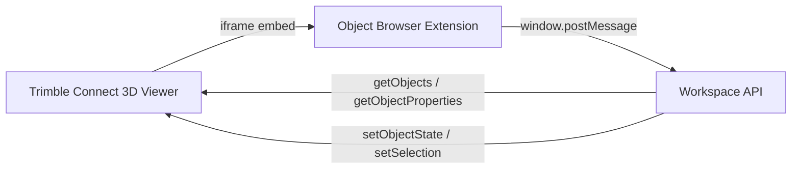

# Trimble Connect Object Browser

A Trimble Connect Web **3D viewer extension** that recreates the desktop **Objects** panel: grouped browsing, search/filter, visibility toggles, and group colorization.

## Features

- **Show** filter: all objects, visible only, or hidden only
- **Group by any IFC property**: the dropdown is populated from every property
  set / property found across the loaded models, plus built-in name/class/type.
- **Searchable group-by picker**: the "Type to search a property…" box filters
  the list of properties you can group by.
- **Filter across every property**: the Filter box matches against every IFC
  property name and value, not just the visible columns.
- **Customizable columns**: the **Columns** button lets you choose which IFC
  properties appear as columns (the object-name column is always shown).
- **Assembly-aware breakdown** (mirrors Trimble Connect Desktop):
  - When the viewer is in **assembly selection mode**, groups expand to
    assemblies, and assemblies expand to individual objects.
  - When **not** in assembly mode, groups expand straight to objects.
- **Click a row to select it in the model** (group, assembly, or object).
  Selection is also reflected back from the viewer.
- **Visibility toggles** per group / assembly / object (via `setObjectState`)
- **Colorize groups** and **Reset colors** (via `setObjectState`)
- Auto-refresh when models are loaded, reset, or when assembly selection mode
  changes.

## Architecture



This extension uses:

- [`trimble-connect-workspace-api`](https://www.npmjs.com/package/trimble-connect-workspace-api) for viewer communication
- `viewer.getObjects()` to enumerate loaded model objects
- `viewer.getObjectProperties()` for names, classes, and author metadata
- `viewer.setObjectState()` for visibility and color
- `viewer.setSelection()` for selection sync

## Quick start

### 1. Install and run locally

```bash
cd trimble-connect-object-browser
npm install
npm run dev
```

The dev server runs at `http://localhost:5173`.

### 2. Update the manifest URL

Edit `public/manifest.json` and set `url` and `icon` to your hosted URLs when deploying. For local testing, the defaults point at `localhost:5173`.

### 3. Register in Trimble Connect

1. Open a project in **Trimble Connect for Browser**
2. Open the **3D viewer**
3. Go to **Settings → Extensions** (3D viewer extensions)
4. Add the manifest URL, for example:
   `http://localhost:5173/manifest.json`
5. Enable the extension

The panel appears in the viewer side panel area.

## Deployment notes

- The manifest URL must be **CORS-enabled** (`Access-Control-Allow-Origin`)
- Use HTTPS in production
- Update `manifest.json` `url` to your deployed app URL before registering

Example production build:

```bash
npm run build
```

Deploy the contents of `dist/` to static hosting (Azure Static Web Apps, S3, Netlify, etc.) and host `manifest.json` from the same origin.

## Desktop parity map

| Desktop Objects panel | This extension |
|---|---|
| Show: All objects | Show dropdown |
| Group by: Object names | Searchable group-by picker (any IFC property) |
| Search property to group by | "Type to search a property…" box |
| Filter | Filter box (matches every property) |
| Expand/collapse groups | Group / assembly / object tree rows |
| Assembly selection mode breakdown | Group → assembly → object levels |
| Eye visibility toggle | Visibility buttons per node |
| Color swatch | Color swatch per group/object |
| Colorize groups | Colorize groups button |
| Reset colors | Reset colors button |
| Object name (count) | Group label with count |
| Configurable columns | Columns button (pick any IFC property) |
| Click row selects in model | Row click → `setSelection` |

## Known limitations

- Large models can take time to load because properties are fetched in batches
- Author name depends on model property sets; many models show `-` like desktop
- Layer-based grouping is not implemented yet (`viewer.getLayers()` is available if you want to add it)
- The extension reads objects from **loaded models only**

## Project layout

```
trimble-connect-object-browser/
  public/manifest.json     # Extension manifest for Trimble Connect
  src/
    api/connect.ts         # Workspace API connection
    services/              # Object loading, grouping, viewer actions
    ui/                    # Panel rendering and interactions
    utils/                 # Name/author/class helpers
```

## References

- [Extend Trimble Connect](https://developer.trimble.com/docs/connect/guides/extend/)
- [Workspace API docs](https://components.connect.trimble.com/trimble-connect-workspace-api/index.html)
- [ViewerAPI](https://components.connect.trimble.com/trimble-connect-workspace-api/interfaces/ViewerAPI.html)
